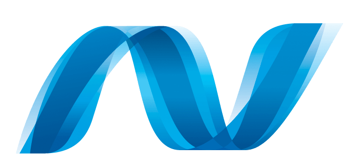

### Hola, I am [Luis Genesius](https://lgenesius.github.io/portfolio-v2/)!  
I am a computer science student who has a passion for creating and developing programs. I spend most of my :clock1: to code projects, watching tutorials and learn something new :grin:
 
### Reach me out! :mailbox:

  

### Know More About Me :smiley:
- 🔭 I’m currently refactoring on my Java project
- 🌱 I’m currently learning mobile development with Android Studio
- 👯 I’m looking to collaborate on mobile projects :iphone:
- 📫 How to reach me: [luis.huang321@gmail.com](mailto:luis.huang321@gmail.com)
- ⚡ Fun fact: I :heart: photography, especially landscape photography! :camera:
  

  

    :computer: <strong>Technologies</strong> 
  

  

  <b>Programming Languages</b> :book: 
  

    
  <b>Web Development</b> 🌠
  

        
  <b>Mobile Development</b> :iphone: 
  

    
  <b>DBMS</b> :floppy_disk: 

   
   

  

    :zap: <strong>Github Stats & Most Used Languages</strong>
  

   
     

