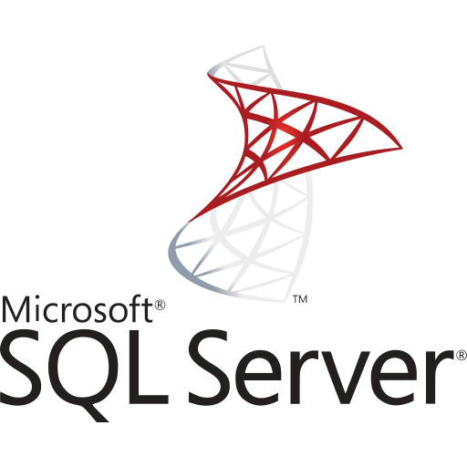

### Hola, I am [Luis Genesius](https://lgenesius.github.io/portfolio-v2/)!  
I am a computer science student who has a passion for creating and developing programs. I spend most of my :clock1: to code projects, watching tutorials and learn something new :grin:
 
### Reach me out! :mailbox:

 

### Know More About Me :smiley:
- 🔭 I’m currently working on Laravel and Java project
- 🌱 I’m currently learning mobile development with Android Studio
- 👯 I’m looking to collaborate on mobile projects
- 📫 How to reach me: [luis.huang321@gmail.com](mailto:luis.huang321@gmail.com)
- ⚡ Fun fact: I :heart: photography, especially landscape! :camera:
  

### Programming Languages, Frameworks and Tools :computer:
         
   

  

    :zap: Github Stats
  

  

